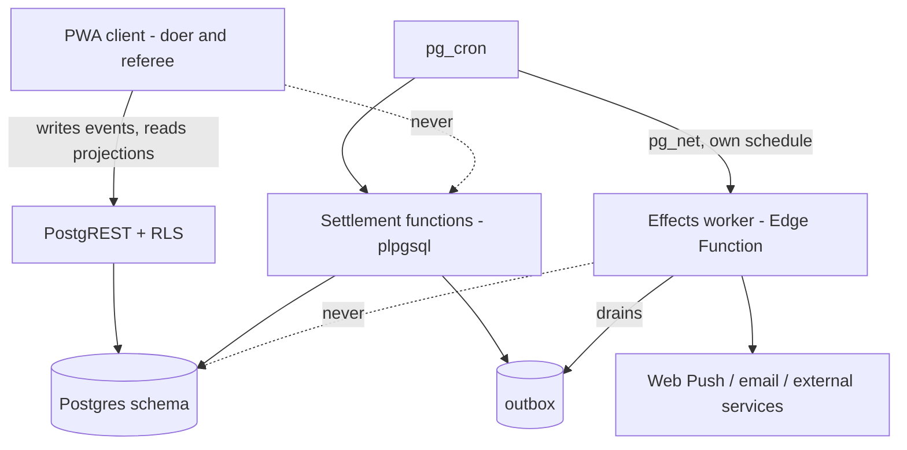
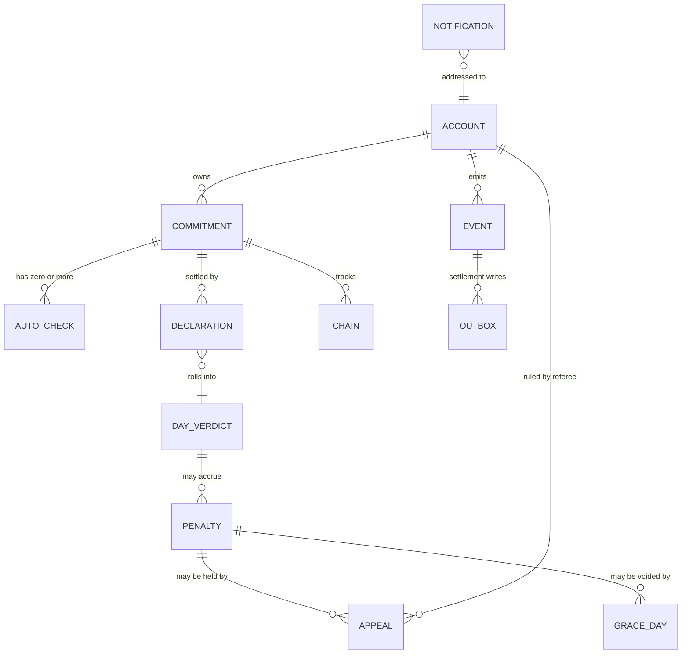
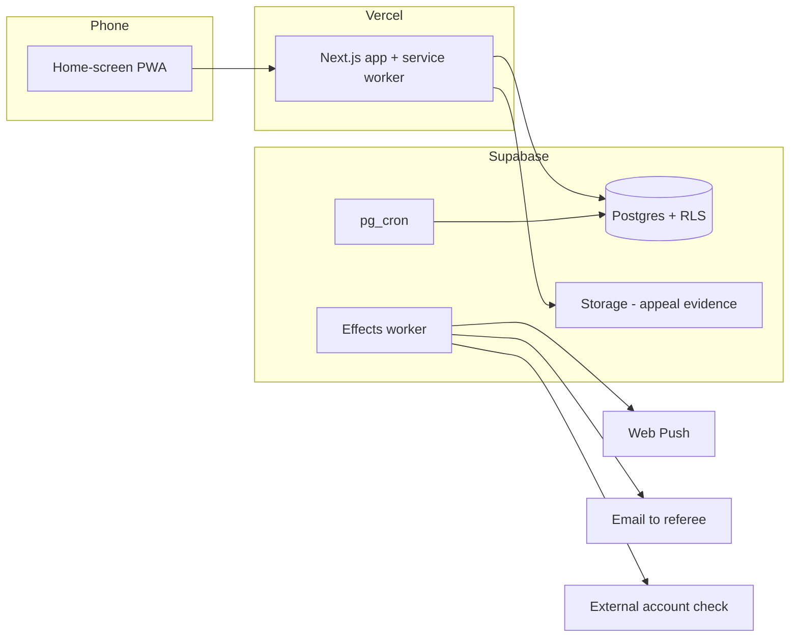

# Architecture Spine — todoapp

## Design Paradigm

**Append-only event log, transactional in-database settlement, transactional outbox.**

The client observes and reports; it never concludes. Everything a user or a sensor produces lands in
an append-only `event` log. A scheduled settlement function reads that log inside a single database
transaction and writes verdicts — day closed, penalty accrued, week settled, declaration expired.
Anything that must leave the system (a push, an email, an external fetch) is written to an outbox in
that same transaction and drained by a separate worker.

This shape is chosen because the product moves real money between two people who know each other. A
penalty the author cannot trace back to the observation that caused it destroys trust in the whole
mechanism, and the ledger is not a screen — it is the data model.

| Layer | Lives in | May depend on |
|---|---|---|
| Client (PWA, both roles) | `app/`, `components/` | the public API surface only |
| API surface | Supabase PostgREST + RLS | the schema |
| Domain / settlement | `supabase/migrations/` plpgsql functions | the schema, the event log |
| Effects worker | `supabase/functions/` Deno/TS | the outbox table only |
| Schedule | `pg_cron` | settlement functions |



## Invariants & Rules

### AD-1 — The server is the sole judge  [ADOPTED]

- **Binds:** all
- **Prevents:** the client and the referee's screen holding different truths; a verdict that only
  exists on a phone that is never opened.
- **Rule:** No client computes a verdict. Clients submit observations (`declaration.filed`,
  `focus.started`, `focus.stopped`, `appeal.submitted`, `collection.marked`). Whether a day failed,
  what is owed, and whether a period is settled are written only by settlement functions.

### AD-2 — Settlement is one transaction, invoked by the database's own scheduler

- **Binds:** FR-2, FR-9, FR-10, FR-13, FR-15, FR-23
- **Prevents:** a partially settled period — money accrued but the day left open, or a penalty
  written twice because a job was retried after a network failure mid-run.
- **Rule:** Every settlement pass runs as a single plpgsql function called directly by `pg_cron`, in
  one transaction. No settlement logic crosses an HTTP boundary. If it cannot be done in that
  transaction, it belongs in the outbox (AD-3), not in the settlement path.

### AD-3 — Everything outbound goes through the transactional outbox

- **Binds:** FR-3, FR-8, FR-18, FR-21, FR-22, FR-23, FR-24
- **Prevents:** a penalty that exists with no notification sent, or a notification sent for a
  settlement that then rolled back.
- **Rule:** Settlement never calls out. It inserts into `outbox` in the same transaction as the
  verdict. A worker drains the outbox at-least-once; every effect carries a dedupe key and must be
  safe to execute twice. Web Push signing, email, and external service reads live only in the worker.
  The worker is woken on its own `pg_cron` schedule via `pg_net`, independently of any settlement
  pass — the outbox must drain even when no settlement ran, or a queue with no consumer looks
  exactly like a working system.

### AD-4 — Every submitted event carries a client-generated idempotency key

- **Binds:** all client writes
- **Prevents:** a queued offline event replaying into two focus sessions or two declarations when
  the network returns.
- **Rule:** The client generates a UUID per logical action at the moment of the action, not at send
  time, and retries reuse it. The event table enforces uniqueness on it.

### AD-5 — A settled period is never re-settled

- **Binds:** FR-2, FR-10, FR-23
- **Prevents:** double-charging when a cron run overlaps, is retried, or is triggered manually.
- **Rule:** Settlement is keyed on `(subject, period, settlement_kind)` with a uniqueness
  constraint. Re-running a pass over an already-settled period is a no-op, not an update. Late-
  arriving events for a settled period are recorded and ignored for that period's verdict.

### AD-6 — One fixed timezone owns every boundary

- **Binds:** FR-2, FR-9, FR-10, FR-23, FR-25
- **Prevents:** a "day" that means something different in the client, the settlement function, and
  the referee's browser — which would move penalties by a day and silently corrupt chains.
- **Rule:** All day, week, and 48-hour boundaries are computed in `Asia/Ho_Chi_Minh`. Timestamps are
  stored as `timestamptz`; every boundary computation converts explicitly. No client ever derives a
  date for storage — it sends an instant, the server derives the day.

### AD-7 — Authorization lives in RLS, never in application code

- **Binds:** FR-19, FR-20, FR-21, and every read path
- **Prevents:** the doer's client and the referee's client — one codebase, two roles — drifting into
  two different, partly-enforced views of who may see what.
- **Rule:** Every table carries row-level security expressing the role rules directly: the referee
  can read appeals and penalties and nothing else; the doer cannot write penalty, verdict, or
  settlement rows at all; nobody rules on their own appeal. Client-side role checks are presentation
  only and are never the enforcement point.

### AD-8 — Every derived value has exactly one writer, and it is settlement

- **Binds:** FR-13, FR-17, FR-20, FR-21, FR-25, and every projection
- **Prevents:** two paths to the same computed value — a client "correction", a repair routine, and
  a settlement pass each writing a balance, a chain, or a quota position and disagreeing.
- **Rule:** Derived state — `penalty`, `chain`, quota progress, ledger balance, every projection —
  is written only by settlement functions. Grace days, appeal rulings, and collection confirmations
  are *events*; they never repair derived state themselves, they cause the next settlement pass to
  fold them in. If a value can be computed from the event log, exactly one settlement function owns
  writing it, and that ownership is declared in the function's name.

### AD-9 — Verdicts are append-only; corrections are new rows

- **Binds:** FR-14, FR-15, FR-17, FR-20
- **Prevents:** losing the trace of why a penalty appeared and then vanished — the exact thing that
  makes the ledger untrustworthy.
- **Rule:** A settled verdict is never mutated. A grace day, a won appeal, or an expiry produces a
  new row referencing the original. The ledger's displayed state is the fold of that chain, not a
  field someone overwrote.

### AD-10 — An unavailable check never produces a miss

- **Binds:** FR-2a, FR-8, FR-8b
- **Prevents:** charging the author 500,000 VND because an external service was down or a permission
  was revoked — which is indistinguishable, from his side, from the system being arbitrary.
- **Rule:** An Auto-check resolves to `held`, `missed`, or `unavailable`. Only `missed` feeds
  FR-2a precedence. `unavailable` falls through to the author's Declaration and the day proceeds as
  if no Auto-check were attached. Absence of a result is `unavailable`, never `missed`.

### AD-11 — Notification lifecycle state lives in the database

- **Binds:** FR-3, FR-9, FR-16
- **Prevents:** persistent re-delivery that only works while the app is open, which is the one
  condition this product cannot rely on.
- **Rule:** Every notification requiring a response is a row with a due time, a re-delivery schedule,
  and a satisfied-at. The scheduler re-queues from that row. The client never schedules its own
  reminders; it only reports that a notification was satisfied.

### AD-12 — One codebase, two roles, role resolved server-side

- **Binds:** all
- **Prevents:** the referee's surface and the doer's surface diverging into two apps with two
  models of the same data.
- **Rule:** Role is a column on the account, read from the session server-side. It selects the route
  group and drives RLS (AD-7). There is no build-time split, no second deployment, and no client-held
  role claim that is trusted for access.

### AD-13 — Auto-checks resolve before the day they belong to is settled

- **Binds:** FR-2a, FR-8, FR-8b, FR-10
- **Prevents:** a settlement pass that runs before the external check has been attempted, so the
  check is recorded `unavailable` every single day — which silently converts an Auto-checked
  Commitment into one the author must answer by hand every morning, the exact opposite of why he
  attached it.
- **Rule:** For day D, every attached Auto-check must reach a terminal result (`held`, `missed`, or
  `unavailable`) before `settle_day(D)` runs. Settlement refuses to run for a day whose checks have
  not been attempted, and reschedules rather than settling on absence. `unavailable` means *tried and
  failed*, never *not yet tried*.

### AD-14 — An event belongs to the day it started

- **Binds:** FR-2, FR-11, FR-25
- **Prevents:** a focus session begun at 23:50 and stopped at 00:20 landing on different days for
  different builders — one crediting the start, one the stop, one splitting at midnight — which
  under a flat penalty is the difference between a Failed Day and a clean one.
- **Rule:** Every event is attributed to the day containing its *start* instant, in the timezone
  fixed by AD-6. Duration accrues wholly to that day. No event is ever split across a boundary.

### AD-15 — A penalty's resolution is a single guarded transition

- **Binds:** FR-14, FR-15, FR-20
- **Prevents:** `settle_week()` dropping a held penalty on timeout at the same moment an
  `appeal.ruled` event converts it to owed — both compliant, opposite outcomes, 500,000 VND
  decided by which transaction commits first.
- **Rule:** A penalty moves from `held` to a terminal state exactly once, under a conditional update
  guarded on its current state. The first writer wins; every later writer is a no-op, not an
  overwrite, and records that it found the penalty already resolved.

### AD-16 — Development can never write a real verdict

- **Binds:** all settlement, all money
- **Prevents:** iterating on `settle_day()` against the one live project and writing a real penalty
  into an append-only ledger (AD-9) that by design cannot be quietly cleaned up.
- **Rule:** Settlement functions refuse to execute outside their scheduled invocation unless an
  explicit override argument is passed, and that argument is rejected when the account is the live
  doer account. Schema and function changes reach the database only through numbered migrations, and
  a migration that changes settlement behavior states which periods it may retroactively affect.

## Consistency Conventions

| Concern | Convention |
|---|---|
| Naming — tables | Singular snake_case domain nouns matching the PRD Glossary exactly: `commitment`, `declaration`, `auto_check`, `penalty`, `appeal`, `grace_day`, `chain`, `event`, `outbox`, `notification`. A new domain noun goes to the Glossary first. |
| Naming — events | `subject.pastTense`: `declaration.filed`, `focus.started`, `focus.stopped`, `appeal.submitted`, `appeal.ruled`, `penalty.collected`, `grace.spent`. |
| Naming — settlement functions | `settle_<scope>()`: `settle_day()`, `settle_week()`, `expire_declarations()`. |
| Ids | `uuid` everywhere; client-generated for events (AD-4), database-generated otherwise. |
| Dates & time | `timestamptz` stored, `Asia/Ho_Chi_Minh` for every boundary (AD-6). Dates are derived, never transmitted. |
| Money | Integer minor units (VND has none, so integer đồng). Never floating point. |
| Errors | Postgres raises typed exceptions; PostgREST surfaces them; the client maps codes to the copy in EXPERIENCE.md. Raw exception text never reaches a user-facing string. |
| Copy | Every user-facing string comes from EXPERIENCE.md § Voice and Tone. New copy is added there first, not invented in a component. |
| Visual tokens | Every color, radius, and type role resolves to a DESIGN.md token. No literal hex in a component. |
| Config & secrets | VAPID keys and service credentials live only in the worker's environment. The client holds the VAPID public key and nothing else. |
| Evidence storage | Appeal evidence goes to a private Storage bucket whose access policy derives from the same rule as the `appeal` row it belongs to (AD-7): the doer who submitted it and the referee ruling on it, nobody else. An object outlives its appeal only as long as the appeal is retained. |
| Migrations | Every schema and function change is a numbered migration under `supabase/migrations/`. Nothing is edited in the dashboard. |
| Testing | Vitest, run by `npm test`. Behaviour that depends on device or browser context — install state, permission state, platform capability — is extracted into a pure function and tested there, never left inside a component where only a real device can exercise it. Test files sit beside the code they cover. |

## Stack

| Name | Version |
|---|---|
| Next.js (App Router, TypeScript) | 16 |
| Serwist (service worker / PWA) | current |
| Supabase — Postgres, Auth, Storage, Edge Functions | current |
| pg_cron | bundled with Supabase, all plans |
| pg_net (wakes the outbox worker) | bundled with Supabase |
| web-push (VAPID) | current |
| Vitest | 4.x |
| Vercel (hosting) | — |

Verified current as of 2026-08-11. The code owns these once it exists.

## Structural Seed





```text
todoapp/
  app/
    (doer)/          # Today, declaration, focus, appeal, ledger, task setup
    (referee)/       # appeals and collections
    api/             # push subscription registration only
  components/        # shared, DESIGN.md tokens only
  lib/               # supabase client, event submission with idempotency keys
  supabase/
    migrations/      # schema + settlement functions + RLS policies + cron schedules
    functions/       # effects worker draining the outbox
  public/            # manifest, icons
```

## Capability → Architecture Map

| Capability / Area | Lives in | Governed by |
|---|---|---|
| Commitment configuration (FR-1) | `(doer)` task setup, `commitment` + `auto_check` | AD-7, AD-12 |
| Precedence when machine and author disagree (FR-2a) | `settle_day()` | AD-1, AD-10 |
| Cadence judging (FR-2) | `settle_day()`, `settle_week()` | AD-2, AD-5, AD-6 |
| Notifications, persistence (FR-3, FR-4, FR-5, FR-12) | `notification` + outbox + worker | AD-3, AD-11 |
| Auto-checks (FR-6, FR-7, FR-8, FR-8b) | worker (external), `auto_check` | AD-3, AD-10 |
| Morning Declaration, Day Close (FR-9, FR-10) | `declaration`, `expire_declarations()`, `settle_day()` | AD-2, AD-6, AD-11 |
| Focus Sessions (FR-11) | `focus.started` / `focus.stopped` events | AD-1, AD-4 |
| Penalty, appeal, settlement (FR-13, FR-14, FR-15) | `penalty`, `appeal`, `settle_*()` | AD-8, AD-9 |
| Recovery, grace (FR-16, FR-17, FR-18) | `notification`, `grace_day`, outbox | AD-3, AD-9, AD-11 |
| Referee surface (FR-19, FR-20, FR-21) | `(referee)` routes | AD-7, AD-12 |
| Reviews and chains (FR-22..FR-25) | projections + outbox | AD-3, AD-9 |

## Deferred

- **Native iOS client, and with it the location and phone-movement Auto-checks.** Blocked on an
  Apple Developer account; a free Apple ID cannot sign the push entitlement, and a PWA cannot run in
  the background. Because the client only reports events (AD-1), swapping it later touches no
  settlement logic. Revisit when the mechanism has proven itself for a month.
- **AlarmKit-grade morning gate.** Same blocker. Until then the gate is a persistent Web Push plus an
  in-app modal.
- **Observability beyond the heartbeat.** Real monitoring is deferred, but not detection: **the daily
  summary is the heartbeat.** If settlement stops — a failed migration, an exhausted quota, or a
  free-tier project paused for inactivity — the summary stops arriving, and that is the signal. This
  matters more than it looks: every silent failure fails *in the author's favor* (no day closes, no
  penalty accrues), so he has no natural reason to notice the mechanism has died. Revisit with real
  alerting before trusting it unattended for a month.
- **Backup and recovery beyond Supabase defaults.** The event log is the recovery story; formalise
  when the ledger has value worth protecting.
- **Event log growth and compaction.** At two users and five commitments this will not matter for
  years. Recorded so it is a decision rather than an oversight.
- **Multi-user, multi-referee, referee supply.** Explicitly out of PRD scope; every table is
  account-scoped so the shape does not block it.
- **Payments of any kind.** Permanently out of scope, not deferred.
