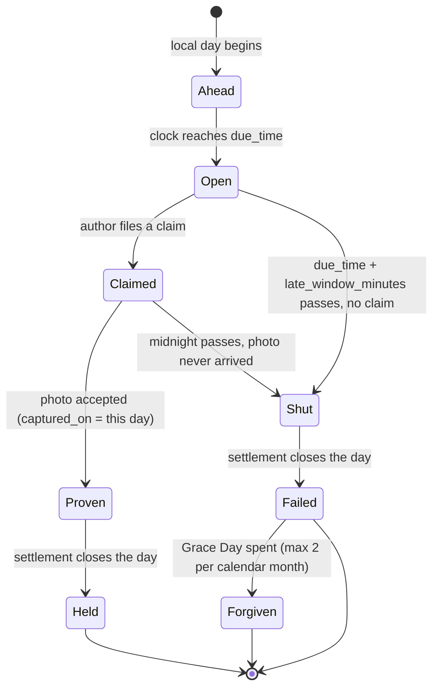
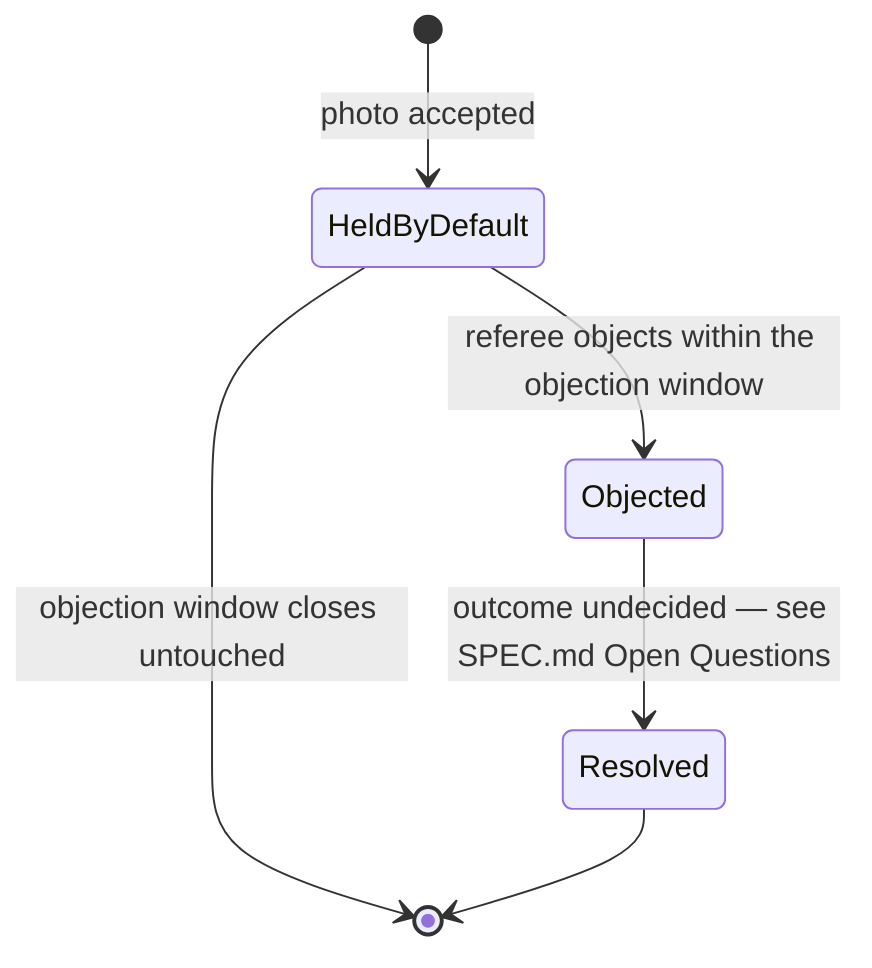

# Lifecycle of a timed commitment

One local day, one commitment, one window. All times are `Asia/Ho_Chi_Minh`.

## The day



Two clocks, deliberately different:

- **The late window** — `due_time` to `due_time + late_window_minutes` — decides whether the *claim* is on time. It cannot cross midnight.
- **Midnight** — decides whether the *photo* arrived at all. A claim filed inside the window with its photo still uploading stays `Claimed` until the photo lands or the day ends.

A claim filed after the window has shut is not a held day. The window is what the money rides on; midnight is only the last moment the evidence can catch up to a claim already made in time.

## Where the photo can fail

| Failure | When it is caught | What the author sees |
|---|---|---|
| Photo captured on the wrong day | Server, on insert | Refused — the capture-date rule already exists and is not relaxed |
| Photo never uploaded before midnight | Settlement, at day close | The day fails; Grace Day is the only remedy |
| No network at the moment of doing | Nowhere — the claim queues | Claim survives; photo must still land before midnight |
| Photo arrives after the day is frozen | Server, on insert | Refused; settled money is not reopened |

## The referee, inverted

The existing dispute runs one way: the machine files a verdict, the author contests it.

```
machine files "missed"  →  author appeals  →  referee rules  →  penalty moves or stands
```

Proof runs the other way, on the same skeleton:

```
author proves the day  →  day holds by default  →  referee may object  →  ??? 
```



The referee is never obliged to act, is never sent a queue, and receives no notification that demands a decision. Silence means held. This is the property that keeps an unpaid friend from becoming an approval bottleneck — and it is why the objection path, not the approval path, is the one being built.

**What the diagram deliberately does not say:** how long the objection window is, what an objection produces, whether it can reach a frozen day, and who carries the burden once it opens. Those are open questions in `SPEC.md` and must be answered before this half is implemented. The proof half (CAP-1 through CAP-4, CAP-6 through CAP-8) does not depend on them.
